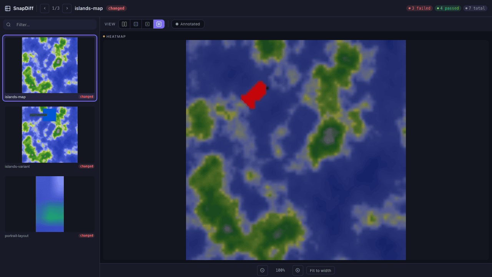
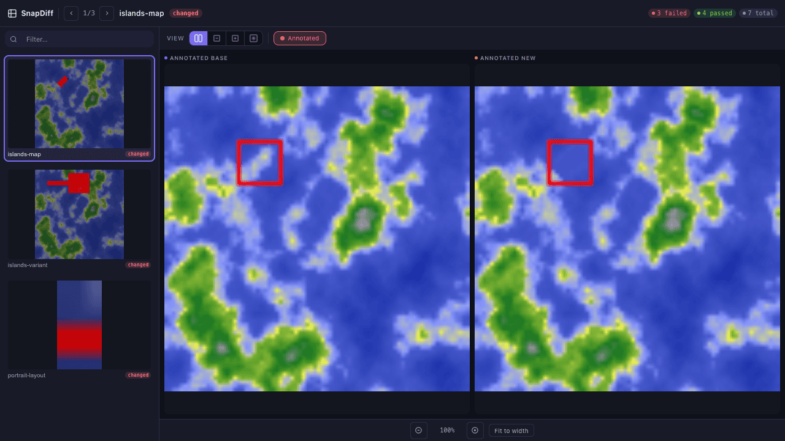

[](https://rubygems.org/gems/capybara-screenshot-diff)
[](https://rubygems.org/gems/capybara-screenshot-diff)
[](https://github.com/snap-diff/snap_diff-capybara/actions/workflows/test.yml)
[](https://deepwiki.com/snap-diff/snap_diff-capybara)

# SnapDiff for Capybara

Stop shipping UI bugs. Take screenshots in your Capybara tests, commit baselines to git, and let CI catch visual regressions in pull requests — no cloud service, no subscription, runs entirely in your test suite.

[](#web-ui-for-reviewing-screenshot-changes)

**Why this gem?** Baselines live in git — review UI changes in pull requests like you review code. Runs offline, works in CI, zero vendor lock-in. Unlike Percy/Chromatic (paid SaaS), nothing to sign up for. Unlike BackstopJS, no Node required.

> **2.1 removed the v1 API.** Everything lives under `SnapDiff` now — the `Capybara::Screenshot::Diff` and `CapybaraScreenshotDiff` namespaces, the `capybara_screenshot_diff/*` require paths, the ChunkyPNG driver, the `driver:` setting and `shift_distance_limit` are gone, not deprecated. 2.0 was the transitional release where both APIs worked and everything that died warned. Coming from 1.x or 2.0? The [upgrade guide](docs/UPGRADING.md) has the change list; the real-world migration was 17 lines across two files.
>
> The gem is published under two names — [`snap_diff-capybara`](https://rubygems.org/gems/snap_diff-capybara) (matching this repository) and [`capybara-screenshot-diff`](https://rubygems.org/gems/capybara-screenshot-diff) — with identical content and versions. Install either; don't install both.

## Quick Start (5 minutes)

> Already using Capybara for system tests? Add the gem and you're ready. New to system tests? See [Rails System Testing guide](https://guides.rubyonrails.org/testing.html#system-testing).

```ruby
# Gemfile
gem 'snap_diff-capybara'
# ruby-vips comes with the gem since 2.1; libvips itself is a system package
# (brew install vips / apt-get install libvips).
```

```ruby
# test/test_helper.rb
require 'snap_diff/integrations/minitest'
```

```ruby
# test/application_system_test_case.rb
class ApplicationSystemTestCase < ActionDispatch::SystemTestCase
  include SnapDiff::Minitest::Assertions
end
```

```ruby
# test/system/homepage_test.rb
class HomepageTest < ApplicationSystemTestCase
  test "homepage" do
    visit "/"
    assert_matches_screenshot "homepage"
  end
end
```

(`screenshot` still works as a shorthand, and is safe to override in your own helpers — the gem no longer calls it internally.)

Then run these steps in order:

```bash
# Step 1: Save baselines (first run always passes)
bundle exec rake test

# Step 2: Commit baselines to git
git add doc/screenshots/
git commit -m "chore: add screenshot baselines"

# Step 3: Now comparisons work — change your UI and re-run
bundle exec rake test
```

After Step 1, you'll see:
```text
doc/screenshots/
  homepage.png          <- your baseline (commit this)
```

Add diff artifacts to `.gitignore` — these are generated at runtime and should not be committed:
```gitignore
# Screenshot diff artifacts (generated, not committed)
*.diff.png
*.base.png
*.diff.webp
*.base.webp
snap_diff_report.html
```

If you skip Step 2 and push to CI, the build will fail — `fail_if_new` is `true` by default in CI.

For RSpec, Cucumber, or non-Rails setup, see [Framework Setup](docs/framework-setup.md).

### For Non-Rails Projects (Hugo, Jekyll, Static Sites)

```ruby
require 'snap_diff/static'
SnapDiff.serve("_site")  # or "public", "build", "dist"
```

Then commit baselines to git just like Rails. [Full setup](docs/ci-integration.md#non-rails-projects-hugo-jekyll-static-sites).

## What Happens When a Screenshot Changes

The test fails with a clear message and generates diff files:

```text
Screenshot does not match for 'homepage':
({"area_size":684.0,"region":[11.0,3.0,49.0,21.0],"difference_level":0.0653125})
```

Open `doc/screenshots/homepage.diff.png` to see exactly what changed. If the change is intentional, delete the baseline and re-run to update it.

| File | Description |
|------|-------------|
| `homepage.png` | Committed baseline |
| `homepage.diff.png` | Visual diff with changes highlighted in red |
| `homepage.heatmap.diff.png` | Heatmap of pixel differences |

## Web UI for Reviewing Screenshot Changes

Add one line to get an interactive dashboard for reviewing all screenshot differences:

```ruby
# test/test_helper.rb
require 'snap_diff/reporters/html'
```

After tests run, open `doc/screenshots/snap_diff_report.html`:



See [Web UI & Custom Reporters](docs/reporters.md) for full feature details and [CI Integration](docs/ci-integration.md) for GitHub Actions setup.

## Compare Any Two Images

Works without a browser — PDFs, generated images, CI artifacts:

```ruby
require 'snap_diff'

result = SnapDiff.compare("baseline.png", "current.png")
result.different?    # => true if visually different
result.quick_equal?  # => true if byte-identical
```

## Next Steps

- **Crop to element:** `screenshot "form", crop: "#main-form"`
- **Ignore regions:** `screenshot "dashboard", skip_area: [".timestamp"]`
- **Disable animations:** `SnapDiff.config.disable_animations = true`
- **Set window size:** `SnapDiff.config.window_size = [1280, 1024]`

## Handling Flaky Tests

Defaults work for most Rails apps — `blur_active_element`, `hide_caret`, and `fail_if_new` (in CI) are enabled automatically.

If screenshots differ between CI and local, set a comparison threshold:

```ruby
SnapDiff.configure do |config|
  config.window_size = [1280, 1024]        # consistent viewport
  config.perceptual_threshold = 2.0        # ignore anti-aliasing
  # or: config.tolerance = 0.001           # percentage-based (the default)
end
```

See [Choosing the Right Method](docs/configuration.md#choosing-the-right-color-comparison-method) for detailed comparison options.

## FAQ

<details>
<summary><strong>The test passed on first run. Did it work?</strong></summary>

Yes. First run saves baselines and always passes. Run tests again to compare against committed baselines.
</details>

<details>
<summary><strong>How do I update baselines after intentional UI changes?</strong></summary>

Delete the baseline file and re-run tests: `rm doc/screenshots/homepage.png && bundle exec rake test`. Or update all: `rm -rf doc/screenshots/ && bundle exec rake test`.
</details>

<details>
<summary><strong>CSS animations make my screenshots flaky</strong></summary>

Enable `SnapDiff.config.disable_animations = true` to freeze CSS animations/transitions before each capture. Or use `stability_time_limit: 1` to wait for animations to finish.
</details>

<details>
<summary><strong>CI screenshots differ from local</strong></summary>

Set `window_size` for consistent dimensions and use `perceptual_threshold: 2.0` to ignore anti-aliasing differences across environments.
</details>

<details>
<summary><strong>Will this slow down my tests?</strong></summary>

Comparisons add ~50ms per image. `stability_time_limit` adds wait time — keep it low (0.1-0.5s) or use `disable_animations` instead.
</details>

<details>
<summary><strong>Debug mode</strong></summary>

`DEBUG=1 bundle exec rake test` keeps `.diff.png` files for inspection.
</details>

## Installation

**Requirements:** Ruby 3.2+. Rails 7.1+ for Rails integration; non-Rails projects supported via `SnapDiff.serve()`. Comparison runs on [libvips](https://libvips.github.io/libvips/install.html) (8.9+), a system package: `brew install vips` on macOS, `apt-get install libvips-dev` on Ubuntu. The `ruby-vips` binding is a runtime dependency of this gem since 2.1, so Bundler installs it for you.

## Docs

- [SnapDiff — the canonical API](docs/snapdiff.md) — setup, config, object map, custom reporters
- [Framework Setup](docs/framework-setup.md) — Minitest, RSpec, Cucumber
- [CI & Non-Rails Integration](docs/ci-integration.md) — GitHub Actions, reusable action, static sites, baseline updates
- [Configuration Reference](docs/configuration.md) — all options explained
- [Image Processing](docs/drivers.md) — libvips, perceptual threshold, tolerance
- [Screenshot Organization](docs/organization.md) — groups, sections, cropping, multi-browser
- [Web UI & Custom Reporters](docs/reporters.md) — interactive report, custom reporters

## Development

After checking out the repo, run `bin/setup` then `rake test`. See [Docker Testing](docs/docker-testing.md) for reproducible CI-matching test runs.

## Contributing

See [CONTRIBUTING.md](https://github.com/snap-diff/snap_diff-capybara/blob/master/CONTRIBUTING.md)

## License

The gem is available as open source under the terms of the [MIT License](http://opensource.org/licenses/MIT).
